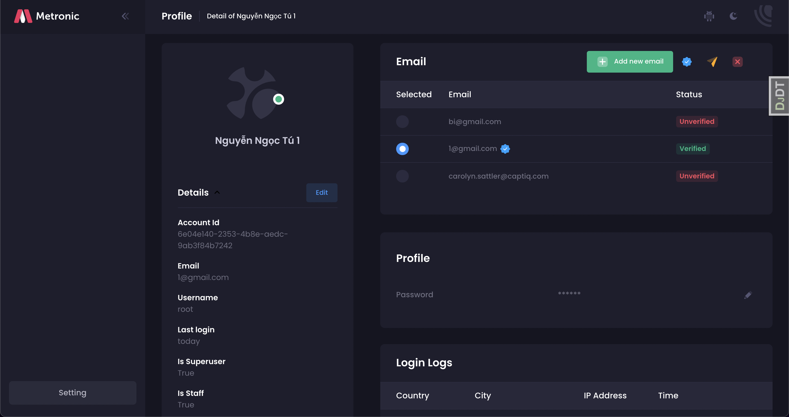
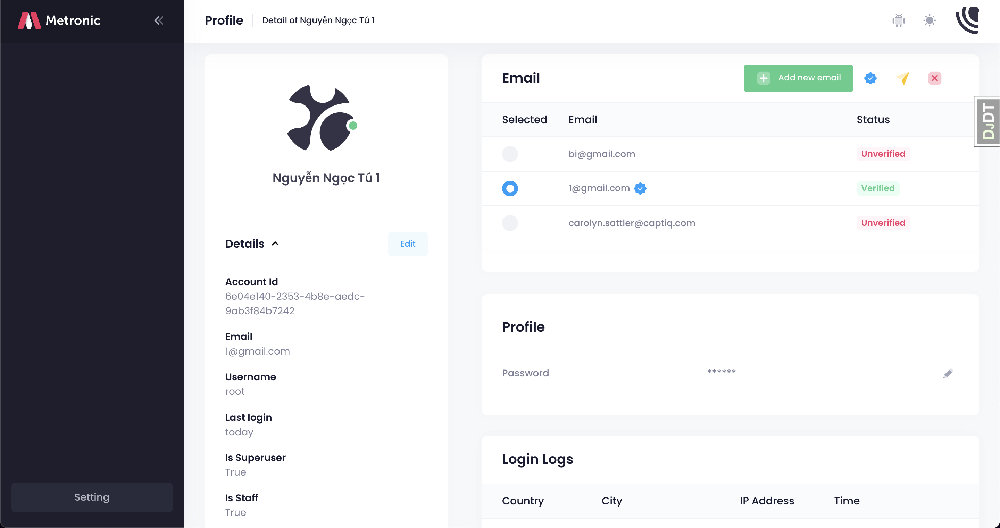
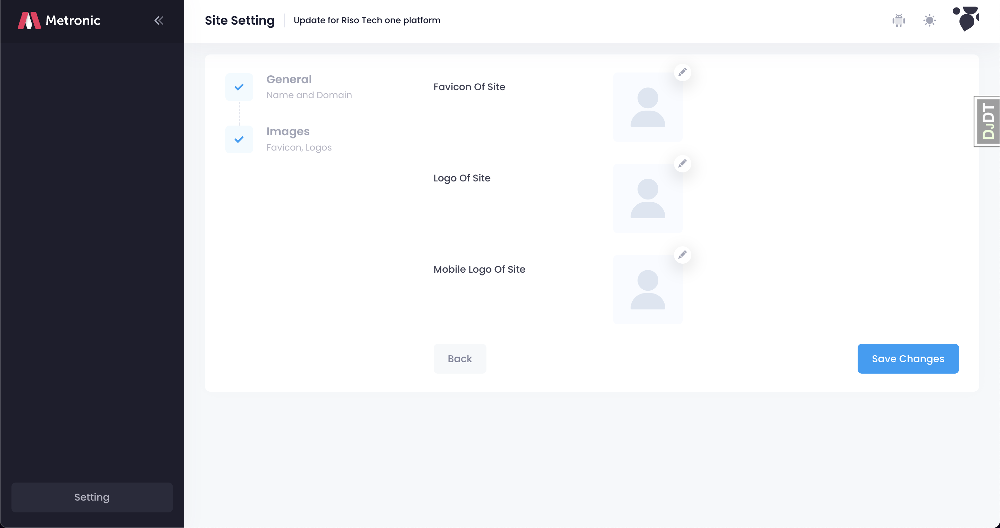

# Riso Tech One platform

**One Platform** is a framework for jumpstarting production-ready Django
projects quickly.

- Based on Django Cookiecutter
- Integrate with modern template Metronic
- Built-in Functions help you start new project quickly
- Documentation: https://github.com/riso-tech/one-platform/tree/master/docs
- Features: https://github.com/riso-tech/one-platform/tree/master/docs/FEATURES.md

## Screenshots

