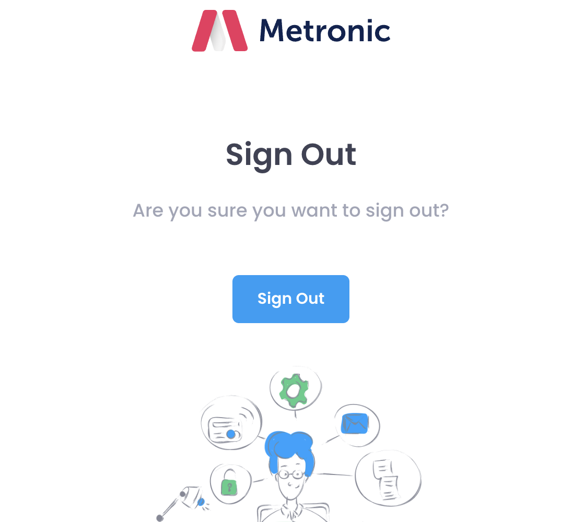
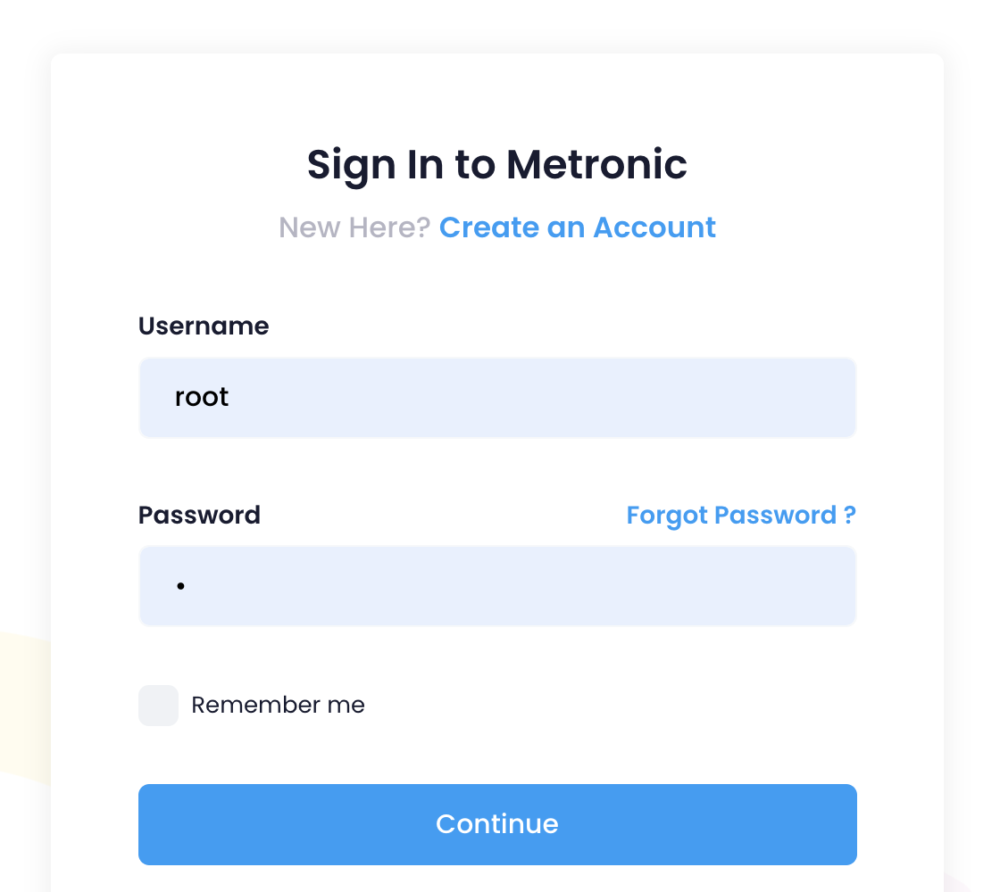
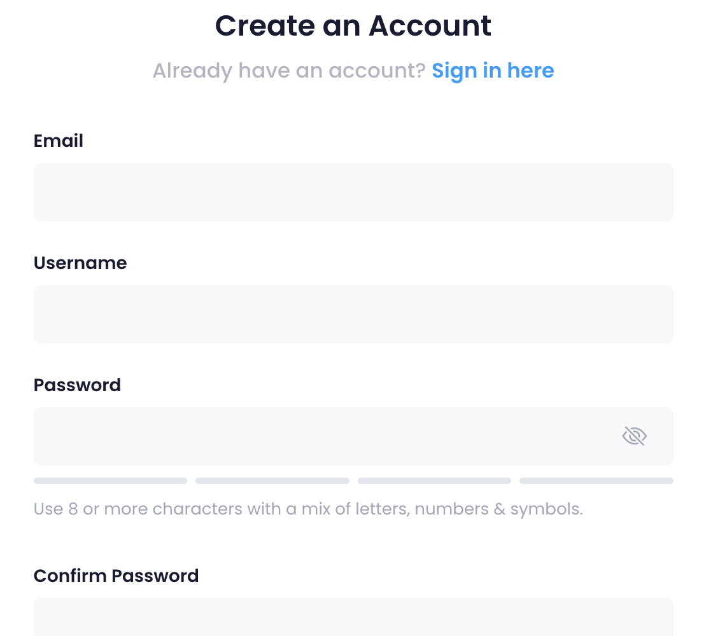
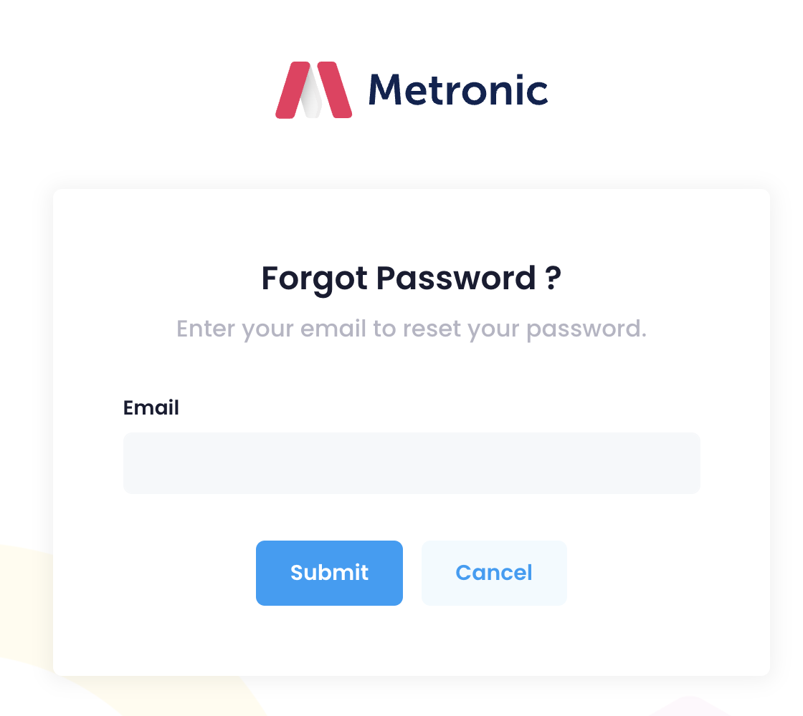
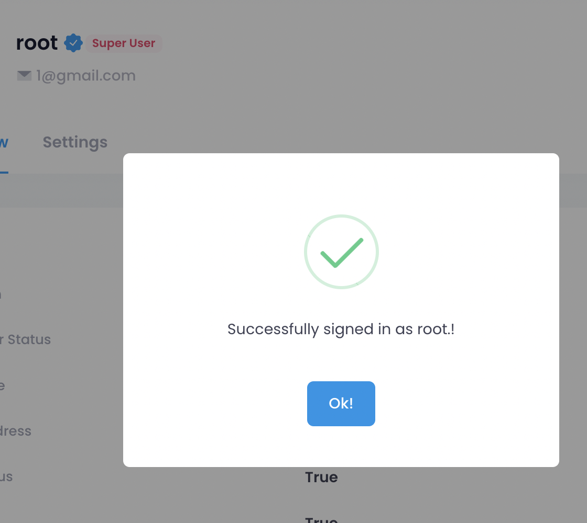
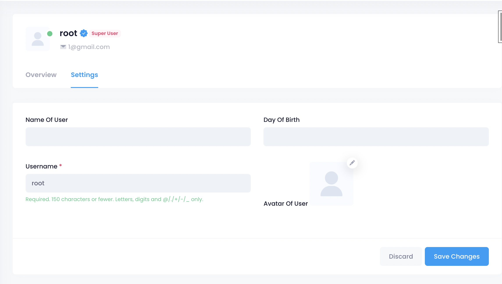
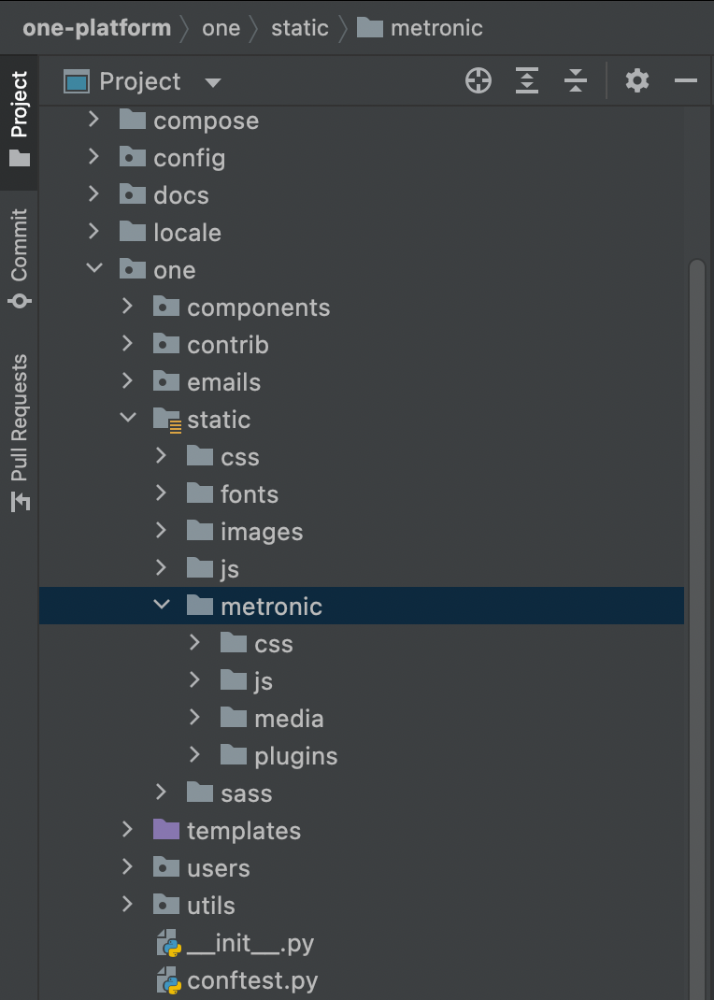

# Riso Tech One platform

Starter kit for Django + Metronic lover!

[](https://github.com/cookiecutter/cookiecutter-django/)
[](https://1.envato.market/NKe19P)
[](https://github.com/ambv/black)
[]()

License: MIT

**One Platform** is a framework for jumpstarting production-ready Django
projects quickly.

- Based on Django Cookiecutter(Update base weekly)
- Integrate with modern template Metronic
- Built-in Functions help you start new project quickly

## Features

- For Django 3.2
- Works with Python 3.9
- [12-Factor](http://12factor.net/) based settings
  via [django-environ](https://github.com/joke2k/django-environ)
- Secure by default. We believe in SSL.
- Optimized development and production settings
- Registration
  via [django-allauth](https://github.com/pennersr/django-allauth) (Custom
  template)
- Email templates for Django allauth management UI
- Comes with custom user model ready to go
- Optional basic ASGI setup for Websockets
- Send emails via [Anymail](https://github.com/anymail/django-anymail) (
  using [Mailgun](http://www.mailgun.com/) by default or Amazon SES if AWS is
  selected cloud provider, but switchable)
- Docker support using [docker-compose](https://github.com/docker/compose) for
  development and production (using [Traefik](https://traefik.io/)
  with [LetsEncrypt](https://letsencrypt.org/) support)
- Run tests with unittest or pytest
- Default integration
  with [pre-commit](https://github.com/pre-commit/pre-commit) for identifying
  simple issues before submission to code review
- Webpush
  notification [document](https://github.com/safwanrahman/django-webpush)
- Multi Language

## Incoming Features

- Custom django field widgets with metronic

## Screenshots

<table style="padding:10px">
  <tr>
    <td></td>
    <td></td>
    <td></td>
  </tr>
  <tr>
    <td></td>
    <td></td>
    <td></td>
  </tr>
  <tr>
      <td></td>
      <td></td>
      <td></td>
    </tr>
</table>

## Installations

#### Metronic (Required)

- Please purchase [Metronic](https://1.envato.market/NKe19P) to get template
  statics to use this platform.
- Follow
  this [guide](https://preview.keenthemes.com/metronic8/demo1/documentation/getting-started/build/gulp.html)
  to create static asset
- Then copy static into "one/static/metronic"
  

## Settings

Moved
to [settings](http://cookiecutter-django.readthedocs.io/en/latest/settings.html)
.

## Basic Commands

### Setting Up Your Users

- To create a **normal user account**, just go to Sign Up and fill out the
  form. Once you submit it, you'll see a "Verify Your E-mail Address" page. Go
  to your console to see a simulated email verification message. Copy the link
  into your browser. Now the user's email should be verified and ready to go.

- To create an **superuser account**, use this command:

      $ python manage.py createsuperuser

For convenience, you can keep your normal user logged in on Chrome and your
superuser logged in on Firefox (or similar), so that you can see how the site
behaves for both kinds of users.

### Type checks

Running type checks with mypy:

    $ mypy one

### Test coverage

To run the tests, check your test coverage, and generate an HTML coverage
report:

    $ coverage run -m pytest
    $ coverage html
    $ open htmlcov/index.html

#### Running tests with pytest

    $ pytest

### Live reloading and Sass CSS compilation

Moved
to [Live reloading and SASS compilation](http://cookiecutter-django.readthedocs.io/en/latest/live-reloading-and-sass-compilation.html)
.

### Celery

This app comes with Celery.

To run a celery worker:

``` bash
cd one
celery -A config.celery_app worker -l info
```

Please note: For Celery's import magic to work, it is important *where* the
celery commands are run. If you are in the same folder with *manage.py*, you
should be right.

### Email Server

In development, it is often nice to be able to see emails that are being sent
from your application. For that reason local SMTP
server [MailHog](https://github.com/mailhog/MailHog) with a web interface is
available as docker container.

Container mailhog will start automatically when you will run all docker
containers. Please
check [cookiecutter-django Docker documentation](http://cookiecutter-django.readthedocs.io/en/latest/deployment-with-docker.html)
for more details how to start all containers.

With MailHog running, to view messages that are sent by your application, open
your browser and go to `http://127.0.0.1:8003`

### Sentry

Sentry is an error logging aggregator service. You can sign up for a free
account at <https://sentry.io/signup/?code=cookiecutter> or download and host
it yourself. The system is set up with reasonable defaults, including 404
logging and integration with the WSGI application.

You must set the DSN url in production.

## Deployment

The following details how to deploy this application.

### Docker

See
detailed [cookiecutter-django Docker documentation](http://cookiecutter-django.readthedocs.io/en/latest/deployment-with-docker.html)
.
