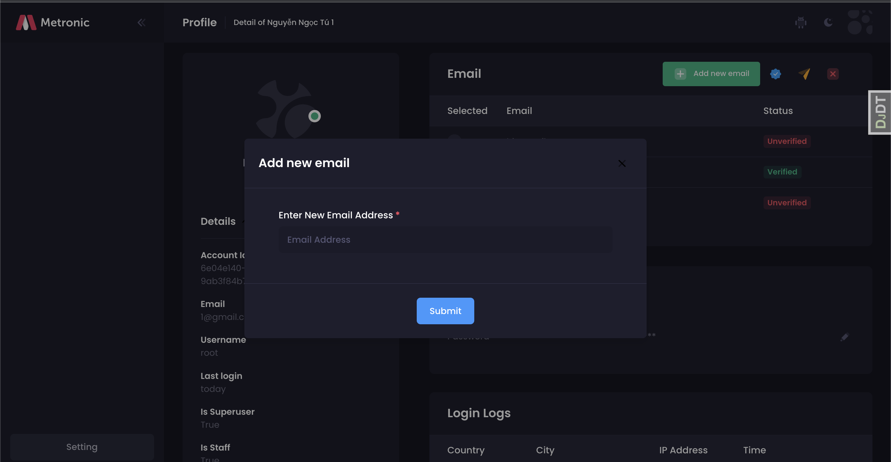
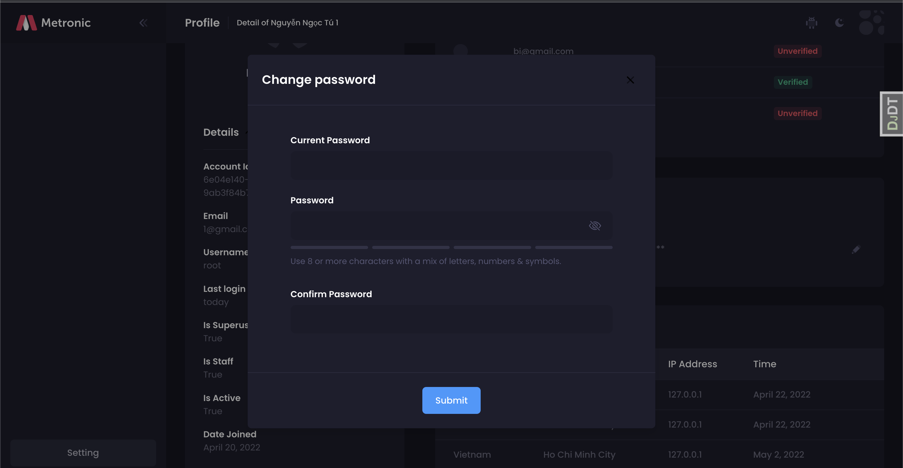
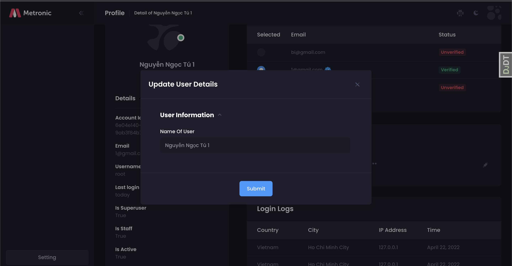
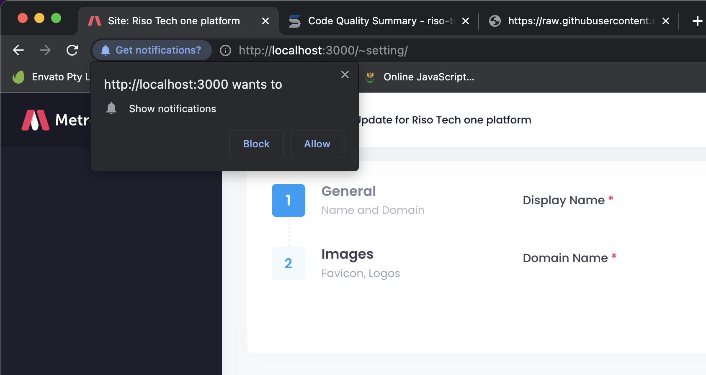
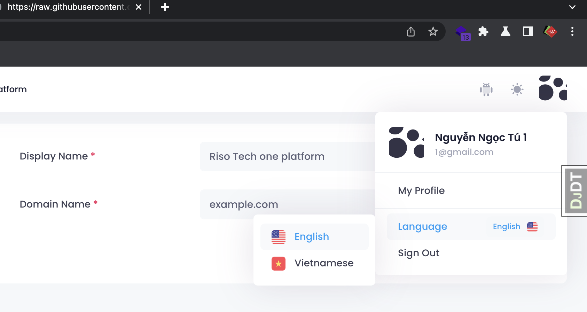
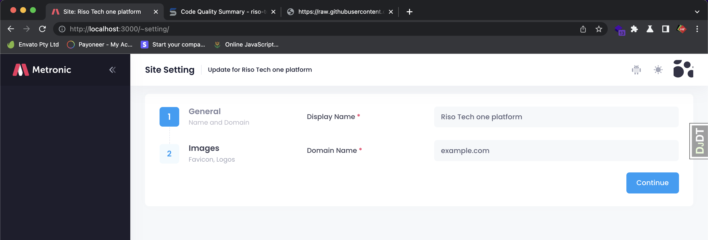
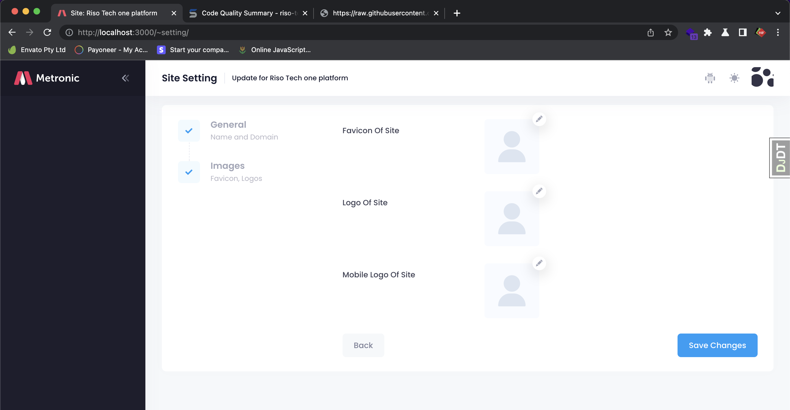
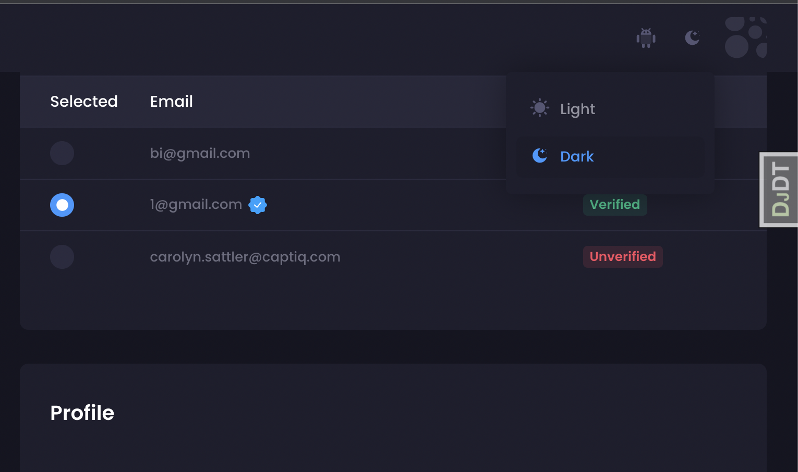

## Base Cookiecutter Features

- For Django 3.2
- Works with Python 3.9
- [12-Factor](http://12factor.net/) based settings
  via [django-environ](https://github.com/joke2k/django-environ)
- Secure by default. We believe in SSL.
- Optimized development and production settings
- Registration
  via [django-allauth](https://github.com/pennersr/django-allauth) (Custom
  template)
- Comes with custom user model ready to go
- Optional basic ASGI setup for Websockets
- Send emails via [Anymail](https://github.com/anymail/django-anymail) (
  using [Mailgun](http://www.mailgun.com/) by default
- Docker support using [docker-compose](https://github.com/docker/compose) for
  development and production (using [Traefik](https://traefik.io/)
  with [LetsEncrypt](https://letsencrypt.org/) support)
- Run tests with unittest or pytest
- Default integration
  with [pre-commit](https://github.com/pre-commit/pre-commit) for identifying
  simple issues before submission to code review

## One Features

- <b>Profile Management</b>

  
  
  
  

- <b>Webpush notification</b> [document](https://github.com/safwanrahman/django-webpush)
  

  

- <b>Multi Languages</b>

  

- <b>Extend Django Site model</b>

  
  

- <b>Dark theme</b>

  

- <b>Extend Django Group</b>

